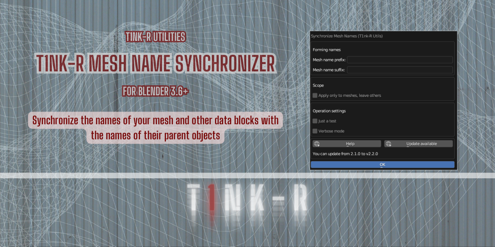
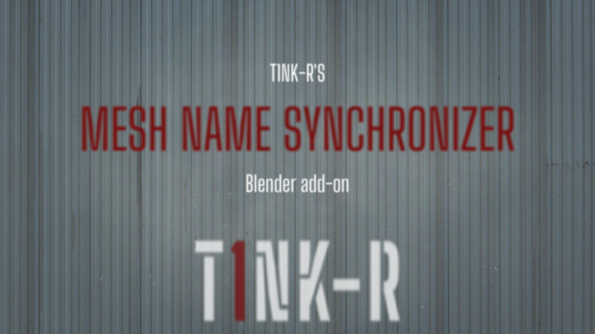
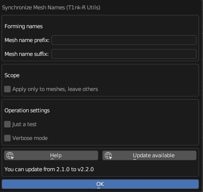

# T1nk-R Mesh Name Synchronizer add-on for Blender

Part of **T1nk-R Utilities for Blender**

Version: Please see the `version` tag under `bl_info` in `__init__.py`.

## TL;DR

You can use this add-on to synchronize the names of meshes with the names of their parent objects.

You need Blender 3.6 or newer for this add-on to work.

[View tutorial in T1nk-R's YouTube channel](https://youtu.be/3OILUmwQH1s)

Help, support, updates and anything else: [https://github.com/gusztavj/T1nkR-Mesh-Name-Synchronizer](https://github.com/gusztavj/T1nkR-Mesh-Name-Synchronizer)

## Legal Stuff

### Copyright

This add-on has been created by [T1nk-R (https://github.com/gusztavj/)](https://github.com/gusztavj/).

#### MIT License

Copyright (c) 2023-2024, T1nk-R (Gusztáv Jánvári)

Permission is hereby granted, free of charge, to any person obtaining a copy of this software and associated documentation files (the "Software"), to deal in the Software without restriction, including without limitation the rights to use, copy, modify, merge, publish, distribute, sublicense, and/or sell copies of the Software, and to permit persons to whom the Software is furnished to do so, subject to the following conditions:

The above copyright notice and this permission notice shall be included in all copies or substantial portions of the Software.

THE SOFTWARE IS PROVIDED "AS IS", WITHOUT WARRANTY OF ANY KIND, EXPRESS OR IMPLIED, INCLUDING BUT NOT LIMITED TO THE WARRANTIES OF MERCHANTABILITY, FITNESS FOR A PARTICULAR PURPOSE AND NONINFRINGEMENT. IN NO EVENT SHALL THE AUTHORS OR COPYRIGHT HOLDERS BE LIABLE FOR ANY CLAIM, DAMAGES OR OTHER LIABILITY, WHETHER IN AN ACTION OF CONTRACT, TORT OR OTHERWISE, ARISING FROM, OUT OF OR IN CONNECTION WITH THE SOFTWARE OR THE USE OR OTHER DEALINGS IN THE SOFTWARE.

#### Commercial Use

I would highly appreciate to get notified via [janvari.gusztav@imprestige.biz](mailto:janvari.gusztav@imprestige.biz) about any such usage. I would be happy to learn this work is of your interest, and to discuss options for commercial support and other services you may need.

### Disclaimer

This add-on is provided as-is. Use at your own risk. No warranties, no guarantee, no liability, no matter what happens. Still I tried to make sure no weird things happen:

* This add-on is intended to change the name of the meshes and other data blocks under your Blender objects.
* This add-on is not intended to modify your objects and other Blender assets in any other way.
* You shall be able to simply undo consequences made by this add-on.

You may learn more about legal matters on page [https://github.com/gusztavj/T1nkR-Mesh-Name-Synchronizer](https://github.com/gusztavj/T1nkR-Mesh-Name-Synchronizer).

## Using the add-on

You can use this add-on when you are in the **Outliner**, meaning that your mouse cursor is floating over an **Outliner** window. To invoke the dialog, either:

* Hit the shortcut, **CTRL+SHIFT+F3** by default.
* Right-click on some empty space in the **Outliner** and find **Synchronize Mesh Names (T1nk-R Utils)** near the end of the menu.
* Right-click on an object in the **Outliner** and find **Synchronize Mesh Names (T1nk-R Utils)** near the end of the menu.
* Right-click on a data block, such as a mesh under an objectin the **Outliner** and find **Synchronize Mesh Names (T1nk-R Utils)** near the end of the menu.

The dialog features a couple of settings:
||
|:--:|
|_The **T1nk-R Mesh Name Synchronizer** dialog_|

### How to Sync

You can specify a prefix and a postfix for the synchronization. If both are empty, all meshes in the [scope](#what-to-sync) will have the same name their parent objects have. If the parent object is called _Foo_, for example, its mesh will also be named _Foo_.

* **Mesh name prefix.** If you specify a prefix in **Mesh name prefix**, it will be added before the parent's name to form the mesh's name. If the parent object is called _Foo_ and you specify the prefix **Mesh of** (with a trailing space), for example, its mesh will be named _Mesh of Foo_.

* **Mesh name suffix.** If you specify a suffix in **Mesh name suffix**, it will be added after the parent's name to form the mesh's name. If the parent object is called _Foo_ and you specify the suffix **(object)** (with a leading space), for example, its mesh will be named _Foo (object)_.

### What to Sync

Names of all kinds of data blocks are synchronized by default. If you check **Apply only to meshes, leave others**, only the names of meshes will be synchronized. Names of data blocks belonging to cameras, lights, empties and so on won't be affected.

### Operation mode

Check **Just a test** if you want to see the effects of your settings before making actual changes. Instead of making any changes, you can consult the **System Console** to learn what would be renamed after unchecking this option.

Check **Verbose mode** if you want to see details in the **System Console** about what is happening.

If you like the results, just uncheck **Just a test** and click **OK**. If you made a mistake, stay in this mode and try to fix your search and replacement terms.
